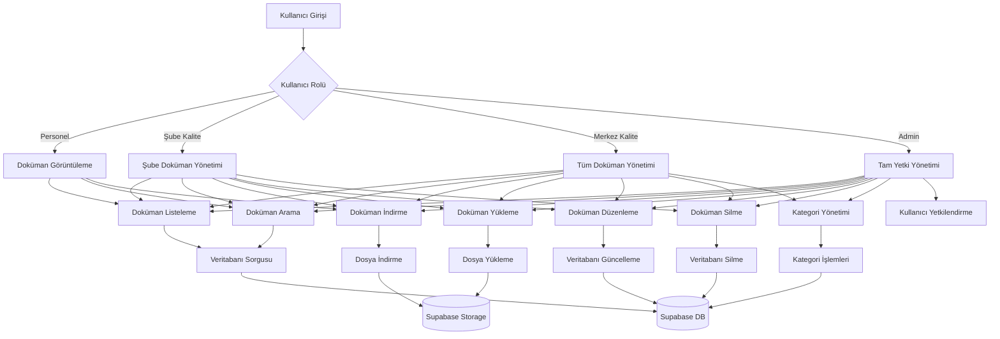
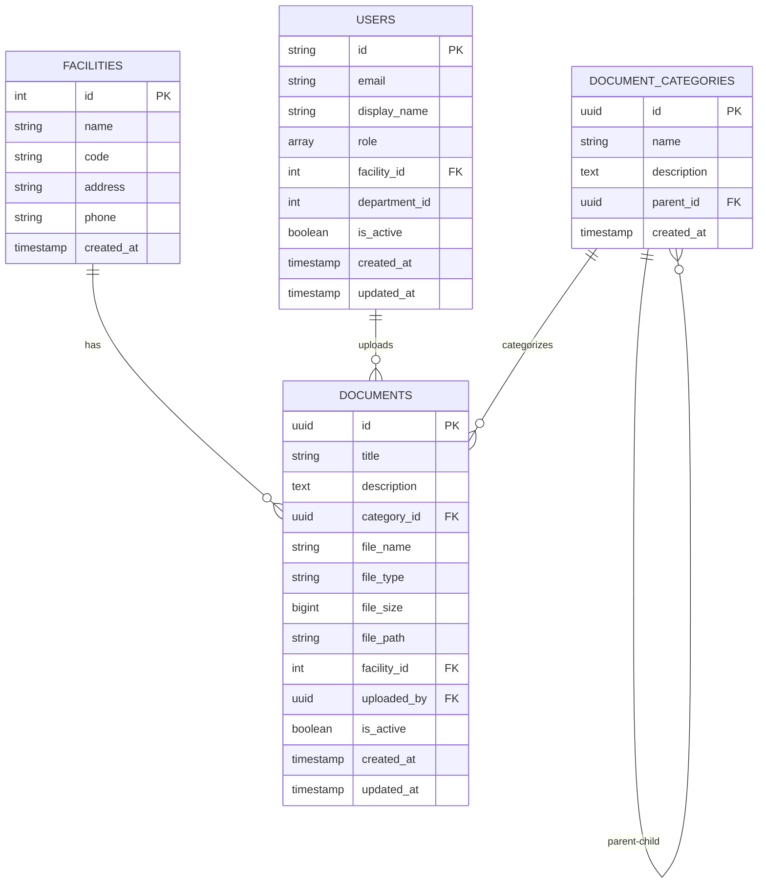
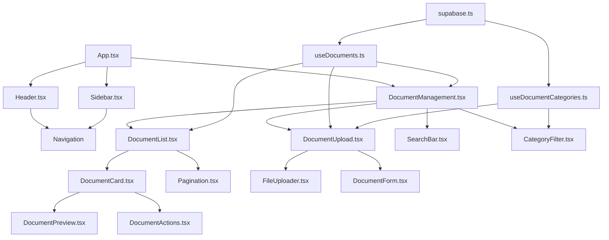
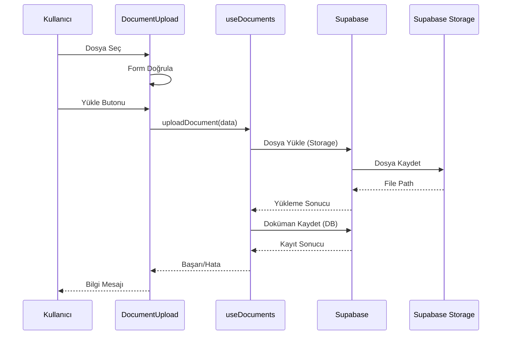

# Doküman Yönetim Sistemi Mimarisi

## Sistem Akış Diyagramı

## Veritabanı İlişkisi

## Bileşen Mimarisi

## Dosya Yükleme Akışı

## Yetkilendirme Matrisi

| Rol | Görüntüleme | Yükleme | Düzenleme | Silme | Kategori Yönetimi |
|-----|-------------|---------|-----------|-------|-------------------|
| Personel | ✅ | ❌ | ❌ | ❌ | ❌ |
| Şube Kalite | ✅ (Şube) | ✅ (Şube) | ✅ (Şube) | ✅ (Şube) | ❌ |
| Merkez Kalite | ✅ (Tümü) | ✅ (Tümü) | ✅ (Tümü) | ✅ (Tümü) | ✅ |
| Admin | ✅ (Tümü) | ✅ (Tümü) | ✅ (Tümü) | ✅ (Tümü) | ✅ |

## Teknoloji Stack

- **Frontend**: React 18 + TypeScript + Vite
- **UI**: Tailwind CSS + Bootstrap Icons
- **Backend**: Supabase (PostgreSQL + Storage)
- **State Management**: React Hooks
- **Routing**: React Router DOM
- **HTTP Client**: Supabase Client

## Performance Optimizasyonları

1. **Lazy Loading**: Doküman listesi sayfalama ile yüklenecek
2. **Image Optimization**: Önizleme görselleri optimize edilecek
3. **Caching**: Sık kullanılan dokümanlar önbelleğe alınacak
4. **Compression**: Dosyalar sıkıştırılarak depolanacak
5. **CDN**: Supabase CDN kullanılacak

## Güvenlik Önlemleri

1. **RLS (Row Level Security)**: Kullanıcı yetkilerine göre erişim kontrolü
2. **File Type Validation**: Sadece izinli dosya tipleri yüklenecek
3. **File Size Limit**: Maksimum dosya boyutu sınırı
4. **Virus Scanning**: Yüklenen dosyalar taranacak
5. **Audit Log**: Tüm işlemler kayıt altına alınacak

## Hata Yönetimi Stratejileri

1. **Network Errors**: Bağlantı hataları için retry mekanizması
2. **Validation Errors**: Form doğrulama hataları
3. **Upload Errors**: Dosya yükleme hataları
4. **Permission Errors**: Yetki hataları
5. **Storage Errors**: Depolama hataları